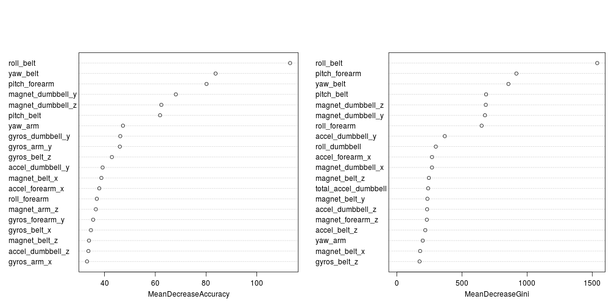

# Assignment - Practical Machine Learning, Coursera
Jesus M. Castagnetto  
June, 2015  


## Introduction

In the "Practical Machine Learning" course at Coursera, the class were been given
a dataset from a Human Activity Recognition (HAR) study that tries to assess 
the quality of an activity (defined as <q>... *the adherence of the execution 
of an activity to its specification* ...</q>), namely a weight lifting exercise,
using data from sensors attached to the individuals and their equipment. 

<aside>
For more details see "[The Weight Lifting Exercises Dataset](http://groupware.les.inf.puc-rio.br/har#weight_lifting_exercises)"
</aside>

In contrast to other HAR studies, the one that generated the datasets[^velloso]
does not attempt to distinguish *what* activity is being done, but 
rather to assess *how well* is the activity being performed.

[^velloso]: Velloso, E.; Bulling, A.; Gellersen, H.; Ugulino, W.; Fuks, H. [Qualitative Activity Recognition of Weight Lifting Exercises](http://groupware.les.inf.puc-rio.br/public/papers/2013.Velloso.QAR-WLE.pdf). Proceedings of 4th International Conference in Cooperation with SIGCHI (Augmented Human '13) . Stuttgart, Germany: ACM SIGCHI, 2013. 

<aside>
**Figure  1: Location of body sensors**[^sensors]

</aside>

[^sensors]: Image obtained from http://groupware.les.inf.puc-rio.br/har#weight_lifting_exercises

In the aforementioned study they use sensors that <q>... *provide three-axes
acceleration, gyroscope and magnetometer data* ...</q>, with a Bluetooth
module that allowed them to capture the experimental data. These sensors
were attached (see *Figure  1*), to 
<q>... *six male participants aged between 20-28 years, with little
weight lifting experience* ...</q> who performed one set of ten repetitions
of the Unilateral Dumbbell Biceps Curl with a 1.25kg (light) dumbbell, 
in five different manners (one correct and four incorrect):

- Exactly according to the specification (Class A)
- Throwing the elbows to the front (Class B)
- Lifting the dumbbell only halfway (Class C)
- Lowering the dumbbell only halfway (Class D)
- Throwing the hips to the front (Class E)

## Getting and cleaning the data


There were two datasets in CSV format, one to be used for
[training](https://d396qusza40orc.cloudfront.net/predmachlearn/pml-train_data.csv), and another one for [testing](https://d396qusza40orc.cloudfront.net/predmachlearn/pml-testing_data.csv). The training dataset contained 19622 rows and 
160 columns, including the `classe` variable 
which classified the entry according to the manner in which it was 
performed (*vide supra*). The testing  dataset has only 
20 rows and 160 columns, with the difference
that instead of the `classe` variable, there is an `problem_id` column to be
used as an identifier for the prediction results, and was supposed to be used
for a second part of the assignment dealing that dealt with specific class
prediction.

<aside>

**Table  1: First 7 columns of the training dataset**

<table style="border-collapse:collapse; border:none;">
<tr>
<th style="border-top: double; text-align:center; font-style:italic; font-weight:normal; padding:0.2cm; border-bottom:1px solid black; ">Variable</th>
<th style="border-top: double; text-align:center; font-style:italic; font-weight:normal; padding:0.2cm; border-bottom:1px solid black;">Type</th>
</tr>
<tr>
<td style="padding:0.2cm; text-align:left; vertical-align:top; text-align:left; ">X</td>
<td style="padding:0.2cm; text-align:left; vertical-align:top; text-align:center;">integer</td>
</tr>
<tr>
<td style="padding:0.2cm; text-align:left; vertical-align:top; text-align:left;  background-color:#eaeaea;">user_name</td>
<td style="padding:0.2cm; text-align:left; vertical-align:top; text-align:center; background-color:#eaeaea;">character</td>
</tr>
<tr>
<td style="padding:0.2cm; text-align:left; vertical-align:top; text-align:left; ">raw_timestamp_part_1</td>
<td style="padding:0.2cm; text-align:left; vertical-align:top; text-align:center;">integer</td>
</tr>
<tr>
<td style="padding:0.2cm; text-align:left; vertical-align:top; text-align:left;  background-color:#eaeaea;">raw_timestamp_part_2</td>
<td style="padding:0.2cm; text-align:left; vertical-align:top; text-align:center; background-color:#eaeaea;">integer</td>
</tr>
<tr>
<td style="padding:0.2cm; text-align:left; vertical-align:top; text-align:left; ">cvtd_timestamp</td>
<td style="padding:0.2cm; text-align:left; vertical-align:top; text-align:center;">character</td>
</tr>
<tr>
<td style="padding:0.2cm; text-align:left; vertical-align:top; text-align:left;  background-color:#eaeaea;">new_window</td>
<td style="padding:0.2cm; text-align:left; vertical-align:top; text-align:center; background-color:#eaeaea;">character</td>
</tr>
<tr>
<td style="padding:0.2cm; text-align:left; vertical-align:top; text-align:left; ">num_window</td>
<td style="padding:0.2cm; text-align:left; vertical-align:top; text-align:center;">integer</td>
</tr>
</table>

</aside>


The first seven columns of the training dataset 
(*X*, *user_name*, *raw_timestamp_part_1*, *raw_timestamp_part_2*, *cvtd_timestamp*, *new_window*, *num_window*)
are not related to the sensor measurements, but rather to the 
identity of the person, and the time stamps and capture windows 
for the sensor data 
(see Table  1). 
Because I am trying to produce a predictive model that only relies on 
the quantitative sensor measurements, I decided to remove
these columns and only consider the sensor values as important factors.
In a similar fashion, the first seven columns of the testing datasets were also removed. This operation left me with 153 columns in the
data frames.

In the resulting data, for each of the four sensors
positioned at the arm, forearm, belt, and dumbbell respectively, there are
38 related measurements (see Table  2 in 
Appendix  1). So, I will try to
select from these 152 numeric variables, the ones that are
more relevant for a predictive model.

The automatic column type assignment from the `read.csv()` R function was not
always correct, in particular because several of the numeric columns contained 
text data coming from sensor reading errors (e.g. "#DIV/0!"). So, I forced all
of the sensor readings to be numeric, and also set the `classe` column as a
factor that contained the exercise classification.


As a result of the type assignment, some columns contained only `NA` values,
so these were not useful and were removed from the dataset. Also, using the
`nearZeroVar()` function of the `caret` package, I eliminated the columns that
were considered uninformative (zero or near zero variance predictors).


<aside>
**Table  3: Number of columns by percentage of missing values**

<table style="border-collapse:collapse; border:none;">
<tr>
<th style="border-top: double; text-align:center; font-style:italic; font-weight:normal; padding:0.2cm; border-bottom:1px solid black;">Percentage of missing values</th>
<th style="border-top: double; text-align:center; font-style:italic; font-weight:normal; padding:0.2cm; border-bottom:1px solid black;">Number of columns</th>
</tr>
<tr>
<td style="padding:0.2cm; text-align:left; vertical-align:top; text-align:center;">0</td>
<td style="padding:0.2cm; text-align:left; vertical-align:top; text-align:center;">53</td>
</tr>
<tr>
<td style="padding:0.2cm; text-align:left; vertical-align:top; text-align:center; background-color:#eaeaea;">98</td>
<td style="padding:0.2cm; text-align:left; vertical-align:top; text-align:center; background-color:#eaeaea;">65</td>
</tr>
</table>

</aside>

After that last operation, the training data frame had only 
118 variables including the classification column.
Of these remaining variables, I checked to see how many of them contained 
too many missing data values. Initially I set the threshold to 80%, but 
soon found out that there were two cases: columns without any missing 
data, and columns that had about 98% of their data as missing 
(see Table  3). 
Trying to impute values in the latter cases could be done, but
is unlikely that we would obtain anything reasonable or useful as a predictor, 
thus, those 65 columns were also removed from the dataset.

In the end we will be using measurements of the *x*, *y*, and *z* axis 
components of the acceleration, gyroscope, and magnetometer sensors, 
as well as the overall acceleration, pitch, roll and yaw (see 
Table  4 in
Appendix  2).

## Generating and validating a Random Forest predictive model

As the provided testing dataset is to be used in a different part of the
assignment (prediction), it could not be used to assess the validity 
of the predictive model I was going to build. So I decided to split the
given "training" dataset into one to be used to perform the random forest model 
training (75% of the data), and another to do validate the model (25% of the data).
The training will also try to assess the quality of the model using an
"out of bag" (OOB) error estimate using cross-validation.


The model training was done using the standard random forest
(`rf`) algorithm[^rfref] method available in the `caret` package, with
the default parameters and doing a 10-fold cross validation. I used the
`classe` variable as the dependent and all the other sensor variables as predictors.
This model gave an OOB error of 0.6%, which indicates that it could be 
a good classifier when used with a new dataset.

[^rfref]: [randomForest: Breiman and Cutler's random forests for classification and regression](http://cran.r-project.org/web/packages/randomForest/)


Using the reserved validation set, I calculated
the confusion matrix (Table  5),
and other relevant statistics using the `confusionMatrix()`
function of the `caret` package. The confusion matrix shows that the
model does a reasonable good job at predicting the exercise quality class.

<aside>
**Table  5: Confusion Matrix (Predicted vs Reference) for Random Forest model**
<table style="border-collapse:collapse; border:none;">
<tr>
<th style="border-top: double; text-align:center; font-style:italic; font-weight:normal; padding:0.2cm; border-bottom:1px solid black; "></th>
<th style="border-top: double; text-align:center; font-style:italic; font-weight:normal; padding:0.2cm; border-bottom:1px solid black;">A</th>
<th style="border-top: double; text-align:center; font-style:italic; font-weight:normal; padding:0.2cm; border-bottom:1px solid black;">B</th>
<th style="border-top: double; text-align:center; font-style:italic; font-weight:normal; padding:0.2cm; border-bottom:1px solid black;">C</th>
<th style="border-top: double; text-align:center; font-style:italic; font-weight:normal; padding:0.2cm; border-bottom:1px solid black;">D</th>
<th style="border-top: double; text-align:center; font-style:italic; font-weight:normal; padding:0.2cm; border-bottom:1px solid black;">E</th>
</tr>
<tr>
<td style="padding:0.2cm; text-align:left; vertical-align:top; text-align:left; ">A</td>
<td style="padding:0.2cm; text-align:left; vertical-align:top; text-align:center;">1395</td>
<td style="padding:0.2cm; text-align:left; vertical-align:top; text-align:center;">12</td>
<td style="padding:0.2cm; text-align:left; vertical-align:top; text-align:center;">0</td>
<td style="padding:0.2cm; text-align:left; vertical-align:top; text-align:center;">0</td>
<td style="padding:0.2cm; text-align:left; vertical-align:top; text-align:center;">0</td>
</tr>
<tr>
<td style="padding:0.2cm; text-align:left; vertical-align:top; text-align:left;  background-color:#eaeaea;">B</td>
<td style="padding:0.2cm; text-align:left; vertical-align:top; text-align:center; background-color:#eaeaea;">0</td>
<td style="padding:0.2cm; text-align:left; vertical-align:top; text-align:center; background-color:#eaeaea;">935</td>
<td style="padding:0.2cm; text-align:left; vertical-align:top; text-align:center; background-color:#eaeaea;">5</td>
<td style="padding:0.2cm; text-align:left; vertical-align:top; text-align:center; background-color:#eaeaea;">0</td>
<td style="padding:0.2cm; text-align:left; vertical-align:top; text-align:center; background-color:#eaeaea;">0</td>
</tr>
<tr>
<td style="padding:0.2cm; text-align:left; vertical-align:top; text-align:left; ">C</td>
<td style="padding:0.2cm; text-align:left; vertical-align:top; text-align:center;">0</td>
<td style="padding:0.2cm; text-align:left; vertical-align:top; text-align:center;">2</td>
<td style="padding:0.2cm; text-align:left; vertical-align:top; text-align:center;">847</td>
<td style="padding:0.2cm; text-align:left; vertical-align:top; text-align:center;">3</td>
<td style="padding:0.2cm; text-align:left; vertical-align:top; text-align:center;">2</td>
</tr>
<tr>
<td style="padding:0.2cm; text-align:left; vertical-align:top; text-align:left;  background-color:#eaeaea;">D</td>
<td style="padding:0.2cm; text-align:left; vertical-align:top; text-align:center; background-color:#eaeaea;">0</td>
<td style="padding:0.2cm; text-align:left; vertical-align:top; text-align:center; background-color:#eaeaea;">0</td>
<td style="padding:0.2cm; text-align:left; vertical-align:top; text-align:center; background-color:#eaeaea;">3</td>
<td style="padding:0.2cm; text-align:left; vertical-align:top; text-align:center; background-color:#eaeaea;">800</td>
<td style="padding:0.2cm; text-align:left; vertical-align:top; text-align:center; background-color:#eaeaea;">0</td>
</tr>
<tr>
<td style="padding:0.2cm; text-align:left; vertical-align:top; text-align:left; ">E</td>
<td style="padding:0.2cm; text-align:left; vertical-align:top; text-align:center;">0</td>
<td style="padding:0.2cm; text-align:left; vertical-align:top; text-align:center;">0</td>
<td style="padding:0.2cm; text-align:left; vertical-align:top; text-align:center;">0</td>
<td style="padding:0.2cm; text-align:left; vertical-align:top; text-align:center;">1</td>
<td style="padding:0.2cm; text-align:left; vertical-align:top; text-align:center;">899</td>
</tr>
</table>

</aside>

Comparing the prediction for validation set with the known class values, 
yielded an accuracy of 0.9943
(95% confidence interval: 
[0.9918, 
0.9962]). The estimated accuracy
is well above the "no information rate" statistic of 
0.2845.
The model also has a high kappa statistic of 0.9928,
which suggest that the process yielded a good classifier. 
Overall this predictive model compares well with what was reported 
in the original study (an accuracy of 0.9803).

The first 20 model predictors can be seen in Figure  2,
and the complete list of predictors (ordered by their mean decrease in 
accuracy) is  in Table  6 
(Appendix  3)

**Figure  2: Variable Importance for Random Forest model (first 20 variables)**
<div class="fullwidth"> <aside style="margin-top: 0em"><aside></div>

This plot indicates that the measurements of the belt sensor (*roll*, *yaw*,
and *pitch*), the forearm (*pitch*) and the dumbbell (*magnetic component*), 
are the most important for distinguishing whether this
particular exercise is being done correctly or not. This makes sense as the
way the core body moves and the rotation of the forearm, are closely related 
to a correct execution of the biceps curl, and in the case of the metallic
dumbbell the position changes are readily detected by the magnetometer.

## Appendices

### Appendix  1: Columns related to the sensors in the original training dataset


**Table  2: Measurement columns by sensor**
<table style="border-collapse:collapse; border:none;">
<tr>
<th style="border-top: double; text-align:center; font-style:italic; font-weight:normal; padding:0.2cm; border-bottom:1px solid black;">arm</th>
<th style="border-top: double; text-align:center; font-style:italic; font-weight:normal; padding:0.2cm; border-bottom:1px solid black;">forearm</th>
<th style="border-top: double; text-align:center; font-style:italic; font-weight:normal; padding:0.2cm; border-bottom:1px solid black;">belt</th>
<th style="border-top: double; text-align:center; font-style:italic; font-weight:normal; padding:0.2cm; border-bottom:1px solid black;">dumbbell</th>
</tr>
<tr>
<td style="padding:0.2cm; text-align:left; vertical-align:top; text-align:center;">accel_arm_x</td>
<td style="padding:0.2cm; text-align:left; vertical-align:top; text-align:center;">accel_forearm_x</td>
<td style="padding:0.2cm; text-align:left; vertical-align:top; text-align:center;">accel_belt_x</td>
<td style="padding:0.2cm; text-align:left; vertical-align:top; text-align:center;">accel_dumbbell_x</td>
</tr>
<tr>
<td style="padding:0.2cm; text-align:left; vertical-align:top; text-align:center; background-color:#eaeaea;">accel_arm_y</td>
<td style="padding:0.2cm; text-align:left; vertical-align:top; text-align:center; background-color:#eaeaea;">accel_forearm_y</td>
<td style="padding:0.2cm; text-align:left; vertical-align:top; text-align:center; background-color:#eaeaea;">accel_belt_y</td>
<td style="padding:0.2cm; text-align:left; vertical-align:top; text-align:center; background-color:#eaeaea;">accel_dumbbell_y</td>
</tr>
<tr>
<td style="padding:0.2cm; text-align:left; vertical-align:top; text-align:center;">accel_arm_z</td>
<td style="padding:0.2cm; text-align:left; vertical-align:top; text-align:center;">accel_forearm_z</td>
<td style="padding:0.2cm; text-align:left; vertical-align:top; text-align:center;">accel_belt_z</td>
<td style="padding:0.2cm; text-align:left; vertical-align:top; text-align:center;">accel_dumbbell_z</td>
</tr>
<tr>
<td style="padding:0.2cm; text-align:left; vertical-align:top; text-align:center; background-color:#eaeaea;">amplitude_pitch_arm</td>
<td style="padding:0.2cm; text-align:left; vertical-align:top; text-align:center; background-color:#eaeaea;">amplitude_pitch_forearm</td>
<td style="padding:0.2cm; text-align:left; vertical-align:top; text-align:center; background-color:#eaeaea;">amplitude_pitch_belt</td>
<td style="padding:0.2cm; text-align:left; vertical-align:top; text-align:center; background-color:#eaeaea;">amplitude_pitch_dumbbell</td>
</tr>
<tr>
<td style="padding:0.2cm; text-align:left; vertical-align:top; text-align:center;">amplitude_roll_arm</td>
<td style="padding:0.2cm; text-align:left; vertical-align:top; text-align:center;">amplitude_roll_forearm</td>
<td style="padding:0.2cm; text-align:left; vertical-align:top; text-align:center;">amplitude_roll_belt</td>
<td style="padding:0.2cm; text-align:left; vertical-align:top; text-align:center;">amplitude_roll_dumbbell</td>
</tr>
<tr>
<td style="padding:0.2cm; text-align:left; vertical-align:top; text-align:center; background-color:#eaeaea;">amplitude_yaw_arm</td>
<td style="padding:0.2cm; text-align:left; vertical-align:top; text-align:center; background-color:#eaeaea;">amplitude_yaw_forearm</td>
<td style="padding:0.2cm; text-align:left; vertical-align:top; text-align:center; background-color:#eaeaea;">amplitude_yaw_belt</td>
<td style="padding:0.2cm; text-align:left; vertical-align:top; text-align:center; background-color:#eaeaea;">amplitude_yaw_dumbbell</td>
</tr>
<tr>
<td style="padding:0.2cm; text-align:left; vertical-align:top; text-align:center;">avg_pitch_arm</td>
<td style="padding:0.2cm; text-align:left; vertical-align:top; text-align:center;">avg_pitch_forearm</td>
<td style="padding:0.2cm; text-align:left; vertical-align:top; text-align:center;">avg_pitch_belt</td>
<td style="padding:0.2cm; text-align:left; vertical-align:top; text-align:center;">avg_pitch_dumbbell</td>
</tr>
<tr>
<td style="padding:0.2cm; text-align:left; vertical-align:top; text-align:center; background-color:#eaeaea;">avg_roll_arm</td>
<td style="padding:0.2cm; text-align:left; vertical-align:top; text-align:center; background-color:#eaeaea;">avg_roll_forearm</td>
<td style="padding:0.2cm; text-align:left; vertical-align:top; text-align:center; background-color:#eaeaea;">avg_roll_belt</td>
<td style="padding:0.2cm; text-align:left; vertical-align:top; text-align:center; background-color:#eaeaea;">avg_roll_dumbbell</td>
</tr>
<tr>
<td style="padding:0.2cm; text-align:left; vertical-align:top; text-align:center;">avg_yaw_arm</td>
<td style="padding:0.2cm; text-align:left; vertical-align:top; text-align:center;">avg_yaw_forearm</td>
<td style="padding:0.2cm; text-align:left; vertical-align:top; text-align:center;">avg_yaw_belt</td>
<td style="padding:0.2cm; text-align:left; vertical-align:top; text-align:center;">avg_yaw_dumbbell</td>
</tr>
<tr>
<td style="padding:0.2cm; text-align:left; vertical-align:top; text-align:center; background-color:#eaeaea;">gyros_arm_x</td>
<td style="padding:0.2cm; text-align:left; vertical-align:top; text-align:center; background-color:#eaeaea;">gyros_forearm_x</td>
<td style="padding:0.2cm; text-align:left; vertical-align:top; text-align:center; background-color:#eaeaea;">gyros_belt_x</td>
<td style="padding:0.2cm; text-align:left; vertical-align:top; text-align:center; background-color:#eaeaea;">gyros_dumbbell_x</td>
</tr>
<tr>
<td style="padding:0.2cm; text-align:left; vertical-align:top; text-align:center;">gyros_arm_y</td>
<td style="padding:0.2cm; text-align:left; vertical-align:top; text-align:center;">gyros_forearm_y</td>
<td style="padding:0.2cm; text-align:left; vertical-align:top; text-align:center;">gyros_belt_y</td>
<td style="padding:0.2cm; text-align:left; vertical-align:top; text-align:center;">gyros_dumbbell_y</td>
</tr>
<tr>
<td style="padding:0.2cm; text-align:left; vertical-align:top; text-align:center; background-color:#eaeaea;">gyros_arm_z</td>
<td style="padding:0.2cm; text-align:left; vertical-align:top; text-align:center; background-color:#eaeaea;">gyros_forearm_z</td>
<td style="padding:0.2cm; text-align:left; vertical-align:top; text-align:center; background-color:#eaeaea;">gyros_belt_z</td>
<td style="padding:0.2cm; text-align:left; vertical-align:top; text-align:center; background-color:#eaeaea;">gyros_dumbbell_z</td>
</tr>
<tr>
<td style="padding:0.2cm; text-align:left; vertical-align:top; text-align:center;">kurtosis_picth_arm</td>
<td style="padding:0.2cm; text-align:left; vertical-align:top; text-align:center;">kurtosis_picth_forearm</td>
<td style="padding:0.2cm; text-align:left; vertical-align:top; text-align:center;">kurtosis_picth_belt</td>
<td style="padding:0.2cm; text-align:left; vertical-align:top; text-align:center;">kurtosis_picth_dumbbell</td>
</tr>
<tr>
<td style="padding:0.2cm; text-align:left; vertical-align:top; text-align:center; background-color:#eaeaea;">kurtosis_roll_arm</td>
<td style="padding:0.2cm; text-align:left; vertical-align:top; text-align:center; background-color:#eaeaea;">kurtosis_roll_forearm</td>
<td style="padding:0.2cm; text-align:left; vertical-align:top; text-align:center; background-color:#eaeaea;">kurtosis_roll_belt</td>
<td style="padding:0.2cm; text-align:left; vertical-align:top; text-align:center; background-color:#eaeaea;">kurtosis_roll_dumbbell</td>
</tr>
<tr>
<td style="padding:0.2cm; text-align:left; vertical-align:top; text-align:center;">kurtosis_yaw_arm</td>
<td style="padding:0.2cm; text-align:left; vertical-align:top; text-align:center;">kurtosis_yaw_forearm</td>
<td style="padding:0.2cm; text-align:left; vertical-align:top; text-align:center;">kurtosis_yaw_belt</td>
<td style="padding:0.2cm; text-align:left; vertical-align:top; text-align:center;">kurtosis_yaw_dumbbell</td>
</tr>
<tr>
<td style="padding:0.2cm; text-align:left; vertical-align:top; text-align:center; background-color:#eaeaea;">magnet_arm_x</td>
<td style="padding:0.2cm; text-align:left; vertical-align:top; text-align:center; background-color:#eaeaea;">magnet_forearm_x</td>
<td style="padding:0.2cm; text-align:left; vertical-align:top; text-align:center; background-color:#eaeaea;">magnet_belt_x</td>
<td style="padding:0.2cm; text-align:left; vertical-align:top; text-align:center; background-color:#eaeaea;">magnet_dumbbell_x</td>
</tr>
<tr>
<td style="padding:0.2cm; text-align:left; vertical-align:top; text-align:center;">magnet_arm_y</td>
<td style="padding:0.2cm; text-align:left; vertical-align:top; text-align:center;">magnet_forearm_y</td>
<td style="padding:0.2cm; text-align:left; vertical-align:top; text-align:center;">magnet_belt_y</td>
<td style="padding:0.2cm; text-align:left; vertical-align:top; text-align:center;">magnet_dumbbell_y</td>
</tr>
<tr>
<td style="padding:0.2cm; text-align:left; vertical-align:top; text-align:center; background-color:#eaeaea;">magnet_arm_z</td>
<td style="padding:0.2cm; text-align:left; vertical-align:top; text-align:center; background-color:#eaeaea;">magnet_forearm_z</td>
<td style="padding:0.2cm; text-align:left; vertical-align:top; text-align:center; background-color:#eaeaea;">magnet_belt_z</td>
<td style="padding:0.2cm; text-align:left; vertical-align:top; text-align:center; background-color:#eaeaea;">magnet_dumbbell_z</td>
</tr>
<tr>
<td style="padding:0.2cm; text-align:left; vertical-align:top; text-align:center;">max_picth_arm</td>
<td style="padding:0.2cm; text-align:left; vertical-align:top; text-align:center;">max_picth_forearm</td>
<td style="padding:0.2cm; text-align:left; vertical-align:top; text-align:center;">max_picth_belt</td>
<td style="padding:0.2cm; text-align:left; vertical-align:top; text-align:center;">max_picth_dumbbell</td>
</tr>
<tr>
<td style="padding:0.2cm; text-align:left; vertical-align:top; text-align:center; background-color:#eaeaea;">max_roll_arm</td>
<td style="padding:0.2cm; text-align:left; vertical-align:top; text-align:center; background-color:#eaeaea;">max_roll_forearm</td>
<td style="padding:0.2cm; text-align:left; vertical-align:top; text-align:center; background-color:#eaeaea;">max_roll_belt</td>
<td style="padding:0.2cm; text-align:left; vertical-align:top; text-align:center; background-color:#eaeaea;">max_roll_dumbbell</td>
</tr>
<tr>
<td style="padding:0.2cm; text-align:left; vertical-align:top; text-align:center;">max_yaw_arm</td>
<td style="padding:0.2cm; text-align:left; vertical-align:top; text-align:center;">max_yaw_forearm</td>
<td style="padding:0.2cm; text-align:left; vertical-align:top; text-align:center;">max_yaw_belt</td>
<td style="padding:0.2cm; text-align:left; vertical-align:top; text-align:center;">max_yaw_dumbbell</td>
</tr>
<tr>
<td style="padding:0.2cm; text-align:left; vertical-align:top; text-align:center; background-color:#eaeaea;">min_pitch_arm</td>
<td style="padding:0.2cm; text-align:left; vertical-align:top; text-align:center; background-color:#eaeaea;">min_pitch_forearm</td>
<td style="padding:0.2cm; text-align:left; vertical-align:top; text-align:center; background-color:#eaeaea;">min_pitch_belt</td>
<td style="padding:0.2cm; text-align:left; vertical-align:top; text-align:center; background-color:#eaeaea;">min_pitch_dumbbell</td>
</tr>
<tr>
<td style="padding:0.2cm; text-align:left; vertical-align:top; text-align:center;">min_roll_arm</td>
<td style="padding:0.2cm; text-align:left; vertical-align:top; text-align:center;">min_roll_forearm</td>
<td style="padding:0.2cm; text-align:left; vertical-align:top; text-align:center;">min_roll_belt</td>
<td style="padding:0.2cm; text-align:left; vertical-align:top; text-align:center;">min_roll_dumbbell</td>
</tr>
<tr>
<td style="padding:0.2cm; text-align:left; vertical-align:top; text-align:center; background-color:#eaeaea;">min_yaw_arm</td>
<td style="padding:0.2cm; text-align:left; vertical-align:top; text-align:center; background-color:#eaeaea;">min_yaw_forearm</td>
<td style="padding:0.2cm; text-align:left; vertical-align:top; text-align:center; background-color:#eaeaea;">min_yaw_belt</td>
<td style="padding:0.2cm; text-align:left; vertical-align:top; text-align:center; background-color:#eaeaea;">min_yaw_dumbbell</td>
</tr>
<tr>
<td style="padding:0.2cm; text-align:left; vertical-align:top; text-align:center;">pitch_arm</td>
<td style="padding:0.2cm; text-align:left; vertical-align:top; text-align:center;">pitch_forearm</td>
<td style="padding:0.2cm; text-align:left; vertical-align:top; text-align:center;">pitch_belt</td>
<td style="padding:0.2cm; text-align:left; vertical-align:top; text-align:center;">pitch_dumbbell</td>
</tr>
<tr>
<td style="padding:0.2cm; text-align:left; vertical-align:top; text-align:center; background-color:#eaeaea;">roll_arm</td>
<td style="padding:0.2cm; text-align:left; vertical-align:top; text-align:center; background-color:#eaeaea;">roll_forearm</td>
<td style="padding:0.2cm; text-align:left; vertical-align:top; text-align:center; background-color:#eaeaea;">roll_belt</td>
<td style="padding:0.2cm; text-align:left; vertical-align:top; text-align:center; background-color:#eaeaea;">roll_dumbbell</td>
</tr>
<tr>
<td style="padding:0.2cm; text-align:left; vertical-align:top; text-align:center;">skewness_pitch_arm</td>
<td style="padding:0.2cm; text-align:left; vertical-align:top; text-align:center;">skewness_pitch_forearm</td>
<td style="padding:0.2cm; text-align:left; vertical-align:top; text-align:center;">skewness_roll_belt</td>
<td style="padding:0.2cm; text-align:left; vertical-align:top; text-align:center;">skewness_pitch_dumbbell</td>
</tr>
<tr>
<td style="padding:0.2cm; text-align:left; vertical-align:top; text-align:center; background-color:#eaeaea;">skewness_roll_arm</td>
<td style="padding:0.2cm; text-align:left; vertical-align:top; text-align:center; background-color:#eaeaea;">skewness_roll_forearm</td>
<td style="padding:0.2cm; text-align:left; vertical-align:top; text-align:center; background-color:#eaeaea;">skewness_roll_belt.1</td>
<td style="padding:0.2cm; text-align:left; vertical-align:top; text-align:center; background-color:#eaeaea;">skewness_roll_dumbbell</td>
</tr>
<tr>
<td style="padding:0.2cm; text-align:left; vertical-align:top; text-align:center;">skewness_yaw_arm</td>
<td style="padding:0.2cm; text-align:left; vertical-align:top; text-align:center;">skewness_yaw_forearm</td>
<td style="padding:0.2cm; text-align:left; vertical-align:top; text-align:center;">skewness_yaw_belt</td>
<td style="padding:0.2cm; text-align:left; vertical-align:top; text-align:center;">skewness_yaw_dumbbell</td>
</tr>
<tr>
<td style="padding:0.2cm; text-align:left; vertical-align:top; text-align:center; background-color:#eaeaea;">stddev_pitch_arm</td>
<td style="padding:0.2cm; text-align:left; vertical-align:top; text-align:center; background-color:#eaeaea;">stddev_pitch_forearm</td>
<td style="padding:0.2cm; text-align:left; vertical-align:top; text-align:center; background-color:#eaeaea;">stddev_pitch_belt</td>
<td style="padding:0.2cm; text-align:left; vertical-align:top; text-align:center; background-color:#eaeaea;">stddev_pitch_dumbbell</td>
</tr>
<tr>
<td style="padding:0.2cm; text-align:left; vertical-align:top; text-align:center;">stddev_roll_arm</td>
<td style="padding:0.2cm; text-align:left; vertical-align:top; text-align:center;">stddev_roll_forearm</td>
<td style="padding:0.2cm; text-align:left; vertical-align:top; text-align:center;">stddev_roll_belt</td>
<td style="padding:0.2cm; text-align:left; vertical-align:top; text-align:center;">stddev_roll_dumbbell</td>
</tr>
<tr>
<td style="padding:0.2cm; text-align:left; vertical-align:top; text-align:center; background-color:#eaeaea;">stddev_yaw_arm</td>
<td style="padding:0.2cm; text-align:left; vertical-align:top; text-align:center; background-color:#eaeaea;">stddev_yaw_forearm</td>
<td style="padding:0.2cm; text-align:left; vertical-align:top; text-align:center; background-color:#eaeaea;">stddev_yaw_belt</td>
<td style="padding:0.2cm; text-align:left; vertical-align:top; text-align:center; background-color:#eaeaea;">stddev_yaw_dumbbell</td>
</tr>
<tr>
<td style="padding:0.2cm; text-align:left; vertical-align:top; text-align:center;">total_accel_arm</td>
<td style="padding:0.2cm; text-align:left; vertical-align:top; text-align:center;">total_accel_forearm</td>
<td style="padding:0.2cm; text-align:left; vertical-align:top; text-align:center;">total_accel_belt</td>
<td style="padding:0.2cm; text-align:left; vertical-align:top; text-align:center;">total_accel_dumbbell</td>
</tr>
<tr>
<td style="padding:0.2cm; text-align:left; vertical-align:top; text-align:center; background-color:#eaeaea;">var_accel_arm</td>
<td style="padding:0.2cm; text-align:left; vertical-align:top; text-align:center; background-color:#eaeaea;">var_accel_forearm</td>
<td style="padding:0.2cm; text-align:left; vertical-align:top; text-align:center; background-color:#eaeaea;">var_pitch_belt</td>
<td style="padding:0.2cm; text-align:left; vertical-align:top; text-align:center; background-color:#eaeaea;">var_accel_dumbbell</td>
</tr>
<tr>
<td style="padding:0.2cm; text-align:left; vertical-align:top; text-align:center;">var_pitch_arm</td>
<td style="padding:0.2cm; text-align:left; vertical-align:top; text-align:center;">var_pitch_forearm</td>
<td style="padding:0.2cm; text-align:left; vertical-align:top; text-align:center;">var_roll_belt</td>
<td style="padding:0.2cm; text-align:left; vertical-align:top; text-align:center;">var_pitch_dumbbell</td>
</tr>
<tr>
<td style="padding:0.2cm; text-align:left; vertical-align:top; text-align:center; background-color:#eaeaea;">var_roll_arm</td>
<td style="padding:0.2cm; text-align:left; vertical-align:top; text-align:center; background-color:#eaeaea;">var_roll_forearm</td>
<td style="padding:0.2cm; text-align:left; vertical-align:top; text-align:center; background-color:#eaeaea;">var_total_accel_belt</td>
<td style="padding:0.2cm; text-align:left; vertical-align:top; text-align:center; background-color:#eaeaea;">var_roll_dumbbell</td>
</tr>
<tr>
<td style="padding:0.2cm; text-align:left; vertical-align:top; text-align:center;">var_yaw_arm</td>
<td style="padding:0.2cm; text-align:left; vertical-align:top; text-align:center;">var_yaw_forearm</td>
<td style="padding:0.2cm; text-align:left; vertical-align:top; text-align:center;">var_yaw_belt</td>
<td style="padding:0.2cm; text-align:left; vertical-align:top; text-align:center;">var_yaw_dumbbell</td>
</tr>
<tr>
<td style="padding:0.2cm; text-align:left; vertical-align:top; text-align:center; background-color:#eaeaea;">yaw_arm</td>
<td style="padding:0.2cm; text-align:left; vertical-align:top; text-align:center; background-color:#eaeaea;">yaw_forearm</td>
<td style="padding:0.2cm; text-align:left; vertical-align:top; text-align:center; background-color:#eaeaea;">yaw_belt</td>
<td style="padding:0.2cm; text-align:left; vertical-align:top; text-align:center; background-color:#eaeaea;">yaw_dumbbell</td>
</tr>
</table>


### Appendix  2: Remaining columns related to the sensors


**Table  4: Remaining measurement columns by sensor**
<table style="border-collapse:collapse; border:none;">
<tr>
<th style="border-top: double; text-align:center; font-style:italic; font-weight:normal; padding:0.2cm; border-bottom:1px solid black;">arm</th>
<th style="border-top: double; text-align:center; font-style:italic; font-weight:normal; padding:0.2cm; border-bottom:1px solid black;">forearm</th>
<th style="border-top: double; text-align:center; font-style:italic; font-weight:normal; padding:0.2cm; border-bottom:1px solid black;">belt</th>
<th style="border-top: double; text-align:center; font-style:italic; font-weight:normal; padding:0.2cm; border-bottom:1px solid black;">dumbbell</th>
</tr>
<tr>
<td style="padding:0.2cm; text-align:left; vertical-align:top; text-align:center;">accel_arm_x</td>
<td style="padding:0.2cm; text-align:left; vertical-align:top; text-align:center;">accel_forearm_x</td>
<td style="padding:0.2cm; text-align:left; vertical-align:top; text-align:center;">accel_belt_x</td>
<td style="padding:0.2cm; text-align:left; vertical-align:top; text-align:center;">accel_dumbbell_x</td>
</tr>
<tr>
<td style="padding:0.2cm; text-align:left; vertical-align:top; text-align:center; background-color:#eaeaea;">accel_arm_y</td>
<td style="padding:0.2cm; text-align:left; vertical-align:top; text-align:center; background-color:#eaeaea;">accel_forearm_y</td>
<td style="padding:0.2cm; text-align:left; vertical-align:top; text-align:center; background-color:#eaeaea;">accel_belt_y</td>
<td style="padding:0.2cm; text-align:left; vertical-align:top; text-align:center; background-color:#eaeaea;">accel_dumbbell_y</td>
</tr>
<tr>
<td style="padding:0.2cm; text-align:left; vertical-align:top; text-align:center;">accel_arm_z</td>
<td style="padding:0.2cm; text-align:left; vertical-align:top; text-align:center;">accel_forearm_z</td>
<td style="padding:0.2cm; text-align:left; vertical-align:top; text-align:center;">accel_belt_z</td>
<td style="padding:0.2cm; text-align:left; vertical-align:top; text-align:center;">accel_dumbbell_z</td>
</tr>
<tr>
<td style="padding:0.2cm; text-align:left; vertical-align:top; text-align:center; background-color:#eaeaea;">gyros_arm_x</td>
<td style="padding:0.2cm; text-align:left; vertical-align:top; text-align:center; background-color:#eaeaea;">gyros_forearm_x</td>
<td style="padding:0.2cm; text-align:left; vertical-align:top; text-align:center; background-color:#eaeaea;">gyros_belt_x</td>
<td style="padding:0.2cm; text-align:left; vertical-align:top; text-align:center; background-color:#eaeaea;">gyros_dumbbell_x</td>
</tr>
<tr>
<td style="padding:0.2cm; text-align:left; vertical-align:top; text-align:center;">gyros_arm_y</td>
<td style="padding:0.2cm; text-align:left; vertical-align:top; text-align:center;">gyros_forearm_y</td>
<td style="padding:0.2cm; text-align:left; vertical-align:top; text-align:center;">gyros_belt_y</td>
<td style="padding:0.2cm; text-align:left; vertical-align:top; text-align:center;">gyros_dumbbell_y</td>
</tr>
<tr>
<td style="padding:0.2cm; text-align:left; vertical-align:top; text-align:center; background-color:#eaeaea;">gyros_arm_z</td>
<td style="padding:0.2cm; text-align:left; vertical-align:top; text-align:center; background-color:#eaeaea;">gyros_forearm_z</td>
<td style="padding:0.2cm; text-align:left; vertical-align:top; text-align:center; background-color:#eaeaea;">gyros_belt_z</td>
<td style="padding:0.2cm; text-align:left; vertical-align:top; text-align:center; background-color:#eaeaea;">gyros_dumbbell_z</td>
</tr>
<tr>
<td style="padding:0.2cm; text-align:left; vertical-align:top; text-align:center;">magnet_arm_x</td>
<td style="padding:0.2cm; text-align:left; vertical-align:top; text-align:center;">magnet_forearm_x</td>
<td style="padding:0.2cm; text-align:left; vertical-align:top; text-align:center;">magnet_belt_x</td>
<td style="padding:0.2cm; text-align:left; vertical-align:top; text-align:center;">magnet_dumbbell_x</td>
</tr>
<tr>
<td style="padding:0.2cm; text-align:left; vertical-align:top; text-align:center; background-color:#eaeaea;">magnet_arm_y</td>
<td style="padding:0.2cm; text-align:left; vertical-align:top; text-align:center; background-color:#eaeaea;">magnet_forearm_y</td>
<td style="padding:0.2cm; text-align:left; vertical-align:top; text-align:center; background-color:#eaeaea;">magnet_belt_y</td>
<td style="padding:0.2cm; text-align:left; vertical-align:top; text-align:center; background-color:#eaeaea;">magnet_dumbbell_y</td>
</tr>
<tr>
<td style="padding:0.2cm; text-align:left; vertical-align:top; text-align:center;">magnet_arm_z</td>
<td style="padding:0.2cm; text-align:left; vertical-align:top; text-align:center;">magnet_forearm_z</td>
<td style="padding:0.2cm; text-align:left; vertical-align:top; text-align:center;">magnet_belt_z</td>
<td style="padding:0.2cm; text-align:left; vertical-align:top; text-align:center;">magnet_dumbbell_z</td>
</tr>
<tr>
<td style="padding:0.2cm; text-align:left; vertical-align:top; text-align:center; background-color:#eaeaea;">pitch_arm</td>
<td style="padding:0.2cm; text-align:left; vertical-align:top; text-align:center; background-color:#eaeaea;">pitch_forearm</td>
<td style="padding:0.2cm; text-align:left; vertical-align:top; text-align:center; background-color:#eaeaea;">pitch_belt</td>
<td style="padding:0.2cm; text-align:left; vertical-align:top; text-align:center; background-color:#eaeaea;">pitch_dumbbell</td>
</tr>
<tr>
<td style="padding:0.2cm; text-align:left; vertical-align:top; text-align:center;">roll_arm</td>
<td style="padding:0.2cm; text-align:left; vertical-align:top; text-align:center;">roll_forearm</td>
<td style="padding:0.2cm; text-align:left; vertical-align:top; text-align:center;">roll_belt</td>
<td style="padding:0.2cm; text-align:left; vertical-align:top; text-align:center;">roll_dumbbell</td>
</tr>
<tr>
<td style="padding:0.2cm; text-align:left; vertical-align:top; text-align:center; background-color:#eaeaea;">total_accel_arm</td>
<td style="padding:0.2cm; text-align:left; vertical-align:top; text-align:center; background-color:#eaeaea;">total_accel_forearm</td>
<td style="padding:0.2cm; text-align:left; vertical-align:top; text-align:center; background-color:#eaeaea;">total_accel_belt</td>
<td style="padding:0.2cm; text-align:left; vertical-align:top; text-align:center; background-color:#eaeaea;">total_accel_dumbbell</td>
</tr>
<tr>
<td style="padding:0.2cm; text-align:left; vertical-align:top; text-align:center;">yaw_arm</td>
<td style="padding:0.2cm; text-align:left; vertical-align:top; text-align:center;">yaw_forearm</td>
<td style="padding:0.2cm; text-align:left; vertical-align:top; text-align:center;">yaw_belt</td>
<td style="padding:0.2cm; text-align:left; vertical-align:top; text-align:center;">yaw_dumbbell</td>
</tr>
</table>


### Appendix  3: Random Forest Model - Variable Importance


**Table  6: Variable importance per class and overall**
<table style="border-collapse:collapse; border:none;">
<tr>
<th style="border-top: double; text-align:center; font-style:italic; font-weight:normal; padding:0.2cm; border-bottom:1px solid black; ">Variable</th>
<th style="border-top: double; text-align:center; font-style:italic; font-weight:normal; padding:0.2cm; border-bottom:1px solid black;">A</th>
<th style="border-top: double; text-align:center; font-style:italic; font-weight:normal; padding:0.2cm; border-bottom:1px solid black;">B</th>
<th style="border-top: double; text-align:center; font-style:italic; font-weight:normal; padding:0.2cm; border-bottom:1px solid black;">C</th>
<th style="border-top: double; text-align:center; font-style:italic; font-weight:normal; padding:0.2cm; border-bottom:1px solid black;">D</th>
<th style="border-top: double; text-align:center; font-style:italic; font-weight:normal; padding:0.2cm; border-bottom:1px solid black;">E</th>
<th style="border-top: double; text-align:center; font-style:italic; font-weight:normal; padding:0.2cm; border-bottom:1px solid black;">MeanDecreaseAccuracy</th>
<th style="border-top: double; text-align:center; font-style:italic; font-weight:normal; padding:0.2cm; border-bottom:1px solid black;">MeanDecreaseGini</th>
</tr>
<tr>
<td style="padding:0.2cm; text-align:left; vertical-align:top; text-align:left; ">roll_belt</td>
<td style="padding:0.2cm; text-align:left; vertical-align:top; text-align:center;">0.1</td>
<td style="padding:0.2cm; text-align:left; vertical-align:top; text-align:center;">0.14</td>
<td style="padding:0.2cm; text-align:left; vertical-align:top; text-align:center;">0.18</td>
<td style="padding:0.2cm; text-align:left; vertical-align:top; text-align:center;">0.17</td>
<td style="padding:0.2cm; text-align:left; vertical-align:top; text-align:center;">0.3</td>
<td style="padding:0.2cm; text-align:left; vertical-align:top; text-align:center;">0.17</td>
<td style="padding:0.2cm; text-align:left; vertical-align:top; text-align:center;">1538.04</td>
</tr>
<tr>
<td style="padding:0.2cm; text-align:left; vertical-align:top; text-align:left;  background-color:#eaeaea;">magnet_dumbbell_y</td>
<td style="padding:0.2cm; text-align:left; vertical-align:top; text-align:center; background-color:#eaeaea;">0.13</td>
<td style="padding:0.2cm; text-align:left; vertical-align:top; text-align:center; background-color:#eaeaea;">0.18</td>
<td style="padding:0.2cm; text-align:left; vertical-align:top; text-align:center; background-color:#eaeaea;">0.24</td>
<td style="padding:0.2cm; text-align:left; vertical-align:top; text-align:center; background-color:#eaeaea;">0.25</td>
<td style="padding:0.2cm; text-align:left; vertical-align:top; text-align:center; background-color:#eaeaea;">0.08</td>
<td style="padding:0.2cm; text-align:left; vertical-align:top; text-align:center; background-color:#eaeaea;">0.17</td>
<td style="padding:0.2cm; text-align:left; vertical-align:top; text-align:center; background-color:#eaeaea;">676.76</td>
</tr>
<tr>
<td style="padding:0.2cm; text-align:left; vertical-align:top; text-align:left; ">roll_forearm</td>
<td style="padding:0.2cm; text-align:left; vertical-align:top; text-align:center;">0.18</td>
<td style="padding:0.2cm; text-align:left; vertical-align:top; text-align:center;">0.14</td>
<td style="padding:0.2cm; text-align:left; vertical-align:top; text-align:center;">0.25</td>
<td style="padding:0.2cm; text-align:left; vertical-align:top; text-align:center;">0.18</td>
<td style="padding:0.2cm; text-align:left; vertical-align:top; text-align:center;">0.09</td>
<td style="padding:0.2cm; text-align:left; vertical-align:top; text-align:center;">0.17</td>
<td style="padding:0.2cm; text-align:left; vertical-align:top; text-align:center;">651.19</td>
</tr>
<tr>
<td style="padding:0.2cm; text-align:left; vertical-align:top; text-align:left;  background-color:#eaeaea;">magnet_dumbbell_z</td>
<td style="padding:0.2cm; text-align:left; vertical-align:top; text-align:center; background-color:#eaeaea;">0.17</td>
<td style="padding:0.2cm; text-align:left; vertical-align:top; text-align:center; background-color:#eaeaea;">0.13</td>
<td style="padding:0.2cm; text-align:left; vertical-align:top; text-align:center; background-color:#eaeaea;">0.2</td>
<td style="padding:0.2cm; text-align:left; vertical-align:top; text-align:center; background-color:#eaeaea;">0.15</td>
<td style="padding:0.2cm; text-align:left; vertical-align:top; text-align:center; background-color:#eaeaea;">0.08</td>
<td style="padding:0.2cm; text-align:left; vertical-align:top; text-align:center; background-color:#eaeaea;">0.15</td>
<td style="padding:0.2cm; text-align:left; vertical-align:top; text-align:center; background-color:#eaeaea;">683.12</td>
</tr>
<tr>
<td style="padding:0.2cm; text-align:left; vertical-align:top; text-align:left; ">yaw_belt</td>
<td style="padding:0.2cm; text-align:left; vertical-align:top; text-align:center;">0.13</td>
<td style="padding:0.2cm; text-align:left; vertical-align:top; text-align:center;">0.12</td>
<td style="padding:0.2cm; text-align:left; vertical-align:top; text-align:center;">0.16</td>
<td style="padding:0.2cm; text-align:left; vertical-align:top; text-align:center;">0.21</td>
<td style="padding:0.2cm; text-align:left; vertical-align:top; text-align:center;">0.07</td>
<td style="padding:0.2cm; text-align:left; vertical-align:top; text-align:center;">0.14</td>
<td style="padding:0.2cm; text-align:left; vertical-align:top; text-align:center;">856.82</td>
</tr>
<tr>
<td style="padding:0.2cm; text-align:left; vertical-align:top; text-align:left;  background-color:#eaeaea;">pitch_forearm</td>
<td style="padding:0.2cm; text-align:left; vertical-align:top; text-align:center; background-color:#eaeaea;">0.13</td>
<td style="padding:0.2cm; text-align:left; vertical-align:top; text-align:center; background-color:#eaeaea;">0.07</td>
<td style="padding:0.2cm; text-align:left; vertical-align:top; text-align:center; background-color:#eaeaea;">0.12</td>
<td style="padding:0.2cm; text-align:left; vertical-align:top; text-align:center; background-color:#eaeaea;">0.14</td>
<td style="padding:0.2cm; text-align:left; vertical-align:top; text-align:center; background-color:#eaeaea;">0.07</td>
<td style="padding:0.2cm; text-align:left; vertical-align:top; text-align:center; background-color:#eaeaea;">0.11</td>
<td style="padding:0.2cm; text-align:left; vertical-align:top; text-align:center; background-color:#eaeaea;">917.67</td>
</tr>
<tr>
<td style="padding:0.2cm; text-align:left; vertical-align:top; text-align:left; ">pitch_belt</td>
<td style="padding:0.2cm; text-align:left; vertical-align:top; text-align:center;">0.07</td>
<td style="padding:0.2cm; text-align:left; vertical-align:top; text-align:center;">0.16</td>
<td style="padding:0.2cm; text-align:left; vertical-align:top; text-align:center;">0.14</td>
<td style="padding:0.2cm; text-align:left; vertical-align:top; text-align:center;">0.15</td>
<td style="padding:0.2cm; text-align:left; vertical-align:top; text-align:center;">0.04</td>
<td style="padding:0.2cm; text-align:left; vertical-align:top; text-align:center;">0.11</td>
<td style="padding:0.2cm; text-align:left; vertical-align:top; text-align:center;">685.43</td>
</tr>
<tr>
<td style="padding:0.2cm; text-align:left; vertical-align:top; text-align:left;  background-color:#eaeaea;">accel_dumbbell_y</td>
<td style="padding:0.2cm; text-align:left; vertical-align:top; text-align:center; background-color:#eaeaea;">0.05</td>
<td style="padding:0.2cm; text-align:left; vertical-align:top; text-align:center; background-color:#eaeaea;">0.05</td>
<td style="padding:0.2cm; text-align:left; vertical-align:top; text-align:center; background-color:#eaeaea;">0.13</td>
<td style="padding:0.2cm; text-align:left; vertical-align:top; text-align:center; background-color:#eaeaea;">0.06</td>
<td style="padding:0.2cm; text-align:left; vertical-align:top; text-align:center; background-color:#eaeaea;">0.04</td>
<td style="padding:0.2cm; text-align:left; vertical-align:top; text-align:center; background-color:#eaeaea;">0.06</td>
<td style="padding:0.2cm; text-align:left; vertical-align:top; text-align:center; background-color:#eaeaea;">368.41</td>
</tr>
<tr>
<td style="padding:0.2cm; text-align:left; vertical-align:top; text-align:left; ">magnet_dumbbell_x</td>
<td style="padding:0.2cm; text-align:left; vertical-align:top; text-align:center;">0.06</td>
<td style="padding:0.2cm; text-align:left; vertical-align:top; text-align:center;">0.06</td>
<td style="padding:0.2cm; text-align:left; vertical-align:top; text-align:center;">0.09</td>
<td style="padding:0.2cm; text-align:left; vertical-align:top; text-align:center;">0.08</td>
<td style="padding:0.2cm; text-align:left; vertical-align:top; text-align:center;">0.03</td>
<td style="padding:0.2cm; text-align:left; vertical-align:top; text-align:center;">0.06</td>
<td style="padding:0.2cm; text-align:left; vertical-align:top; text-align:center;">270.17</td>
</tr>
<tr>
<td style="padding:0.2cm; text-align:left; vertical-align:top; text-align:left;  background-color:#eaeaea;">roll_dumbbell</td>
<td style="padding:0.2cm; text-align:left; vertical-align:top; text-align:center; background-color:#eaeaea;">0.03</td>
<td style="padding:0.2cm; text-align:left; vertical-align:top; text-align:center; background-color:#eaeaea;">0.07</td>
<td style="padding:0.2cm; text-align:left; vertical-align:top; text-align:center; background-color:#eaeaea;">0.08</td>
<td style="padding:0.2cm; text-align:left; vertical-align:top; text-align:center; background-color:#eaeaea;">0.07</td>
<td style="padding:0.2cm; text-align:left; vertical-align:top; text-align:center; background-color:#eaeaea;">0.04</td>
<td style="padding:0.2cm; text-align:left; vertical-align:top; text-align:center; background-color:#eaeaea;">0.06</td>
<td style="padding:0.2cm; text-align:left; vertical-align:top; text-align:center; background-color:#eaeaea;">299.67</td>
</tr>
<tr>
<td style="padding:0.2cm; text-align:left; vertical-align:top; text-align:left; ">accel_forearm_x</td>
<td style="padding:0.2cm; text-align:left; vertical-align:top; text-align:center;">0.03</td>
<td style="padding:0.2cm; text-align:left; vertical-align:top; text-align:center;">0.05</td>
<td style="padding:0.2cm; text-align:left; vertical-align:top; text-align:center;">0.05</td>
<td style="padding:0.2cm; text-align:left; vertical-align:top; text-align:center;">0.09</td>
<td style="padding:0.2cm; text-align:left; vertical-align:top; text-align:center;">0.04</td>
<td style="padding:0.2cm; text-align:left; vertical-align:top; text-align:center;">0.05</td>
<td style="padding:0.2cm; text-align:left; vertical-align:top; text-align:center;">270.45</td>
</tr>
<tr>
<td style="padding:0.2cm; text-align:left; vertical-align:top; text-align:left;  background-color:#eaeaea;">magnet_belt_z</td>
<td style="padding:0.2cm; text-align:left; vertical-align:top; text-align:center; background-color:#eaeaea;">0.03</td>
<td style="padding:0.2cm; text-align:left; vertical-align:top; text-align:center; background-color:#eaeaea;">0.07</td>
<td style="padding:0.2cm; text-align:left; vertical-align:top; text-align:center; background-color:#eaeaea;">0.06</td>
<td style="padding:0.2cm; text-align:left; vertical-align:top; text-align:center; background-color:#eaeaea;">0.06</td>
<td style="padding:0.2cm; text-align:left; vertical-align:top; text-align:center; background-color:#eaeaea;">0.04</td>
<td style="padding:0.2cm; text-align:left; vertical-align:top; text-align:center; background-color:#eaeaea;">0.05</td>
<td style="padding:0.2cm; text-align:left; vertical-align:top; text-align:center; background-color:#eaeaea;">246.52</td>
</tr>
<tr>
<td style="padding:0.2cm; text-align:left; vertical-align:top; text-align:left; ">accel_dumbbell_z</td>
<td style="padding:0.2cm; text-align:left; vertical-align:top; text-align:center;">0.03</td>
<td style="padding:0.2cm; text-align:left; vertical-align:top; text-align:center;">0.05</td>
<td style="padding:0.2cm; text-align:left; vertical-align:top; text-align:center;">0.06</td>
<td style="padding:0.2cm; text-align:left; vertical-align:top; text-align:center;">0.06</td>
<td style="padding:0.2cm; text-align:left; vertical-align:top; text-align:center;">0.05</td>
<td style="padding:0.2cm; text-align:left; vertical-align:top; text-align:center;">0.05</td>
<td style="padding:0.2cm; text-align:left; vertical-align:top; text-align:center;">232.89</td>
</tr>
<tr>
<td style="padding:0.2cm; text-align:left; vertical-align:top; text-align:left;  background-color:#eaeaea;">magnet_belt_y</td>
<td style="padding:0.2cm; text-align:left; vertical-align:top; text-align:center; background-color:#eaeaea;">0.02</td>
<td style="padding:0.2cm; text-align:left; vertical-align:top; text-align:center; background-color:#eaeaea;">0.07</td>
<td style="padding:0.2cm; text-align:left; vertical-align:top; text-align:center; background-color:#eaeaea;">0.04</td>
<td style="padding:0.2cm; text-align:left; vertical-align:top; text-align:center; background-color:#eaeaea;">0.05</td>
<td style="padding:0.2cm; text-align:left; vertical-align:top; text-align:center; background-color:#eaeaea;">0.04</td>
<td style="padding:0.2cm; text-align:left; vertical-align:top; text-align:center; background-color:#eaeaea;">0.04</td>
<td style="padding:0.2cm; text-align:left; vertical-align:top; text-align:center; background-color:#eaeaea;">235.13</td>
</tr>
<tr>
<td style="padding:0.2cm; text-align:left; vertical-align:top; text-align:left; ">magnet_forearm_z</td>
<td style="padding:0.2cm; text-align:left; vertical-align:top; text-align:center;">0.04</td>
<td style="padding:0.2cm; text-align:left; vertical-align:top; text-align:center;">0.03</td>
<td style="padding:0.2cm; text-align:left; vertical-align:top; text-align:center;">0.05</td>
<td style="padding:0.2cm; text-align:left; vertical-align:top; text-align:center;">0.04</td>
<td style="padding:0.2cm; text-align:left; vertical-align:top; text-align:center;">0.02</td>
<td style="padding:0.2cm; text-align:left; vertical-align:top; text-align:center;">0.04</td>
<td style="padding:0.2cm; text-align:left; vertical-align:top; text-align:center;">230.82</td>
</tr>
<tr>
<td style="padding:0.2cm; text-align:left; vertical-align:top; text-align:left;  background-color:#eaeaea;">total_accel_dumbbell</td>
<td style="padding:0.2cm; text-align:left; vertical-align:top; text-align:center; background-color:#eaeaea;">0.02</td>
<td style="padding:0.2cm; text-align:left; vertical-align:top; text-align:center; background-color:#eaeaea;">0.03</td>
<td style="padding:0.2cm; text-align:left; vertical-align:top; text-align:center; background-color:#eaeaea;">0.02</td>
<td style="padding:0.2cm; text-align:left; vertical-align:top; text-align:center; background-color:#eaeaea;">0.07</td>
<td style="padding:0.2cm; text-align:left; vertical-align:top; text-align:center; background-color:#eaeaea;">0.03</td>
<td style="padding:0.2cm; text-align:left; vertical-align:top; text-align:center; background-color:#eaeaea;">0.03</td>
<td style="padding:0.2cm; text-align:left; vertical-align:top; text-align:center; background-color:#eaeaea;">240.75</td>
</tr>
<tr>
<td style="padding:0.2cm; text-align:left; vertical-align:top; text-align:left; ">accel_belt_z</td>
<td style="padding:0.2cm; text-align:left; vertical-align:top; text-align:center;">0.02</td>
<td style="padding:0.2cm; text-align:left; vertical-align:top; text-align:center;">0.03</td>
<td style="padding:0.2cm; text-align:left; vertical-align:top; text-align:center;">0.04</td>
<td style="padding:0.2cm; text-align:left; vertical-align:top; text-align:center;">0.03</td>
<td style="padding:0.2cm; text-align:left; vertical-align:top; text-align:center;">0.02</td>
<td style="padding:0.2cm; text-align:left; vertical-align:top; text-align:center;">0.03</td>
<td style="padding:0.2cm; text-align:left; vertical-align:top; text-align:center;">218.91</td>
</tr>
<tr>
<td style="padding:0.2cm; text-align:left; vertical-align:top; text-align:left;  background-color:#eaeaea;">gyros_belt_z</td>
<td style="padding:0.2cm; text-align:left; vertical-align:top; text-align:center; background-color:#eaeaea;">0.02</td>
<td style="padding:0.2cm; text-align:left; vertical-align:top; text-align:center; background-color:#eaeaea;">0.04</td>
<td style="padding:0.2cm; text-align:left; vertical-align:top; text-align:center; background-color:#eaeaea;">0.05</td>
<td style="padding:0.2cm; text-align:left; vertical-align:top; text-align:center; background-color:#eaeaea;">0.02</td>
<td style="padding:0.2cm; text-align:left; vertical-align:top; text-align:center; background-color:#eaeaea;">0.02</td>
<td style="padding:0.2cm; text-align:left; vertical-align:top; text-align:center; background-color:#eaeaea;">0.03</td>
<td style="padding:0.2cm; text-align:left; vertical-align:top; text-align:center; background-color:#eaeaea;">174.78</td>
</tr>
<tr>
<td style="padding:0.2cm; text-align:left; vertical-align:top; text-align:left; ">yaw_dumbbell</td>
<td style="padding:0.2cm; text-align:left; vertical-align:top; text-align:center;">0.02</td>
<td style="padding:0.2cm; text-align:left; vertical-align:top; text-align:center;">0.04</td>
<td style="padding:0.2cm; text-align:left; vertical-align:top; text-align:center;">0.04</td>
<td style="padding:0.2cm; text-align:left; vertical-align:top; text-align:center;">0.03</td>
<td style="padding:0.2cm; text-align:left; vertical-align:top; text-align:center;">0.02</td>
<td style="padding:0.2cm; text-align:left; vertical-align:top; text-align:center;">0.03</td>
<td style="padding:0.2cm; text-align:left; vertical-align:top; text-align:center;">142.08</td>
</tr>
<tr>
<td style="padding:0.2cm; text-align:left; vertical-align:top; text-align:left;  background-color:#eaeaea;">accel_dumbbell_x</td>
<td style="padding:0.2cm; text-align:left; vertical-align:top; text-align:center; background-color:#eaeaea;">0.02</td>
<td style="padding:0.2cm; text-align:left; vertical-align:top; text-align:center; background-color:#eaeaea;">0.03</td>
<td style="padding:0.2cm; text-align:left; vertical-align:top; text-align:center; background-color:#eaeaea;">0.04</td>
<td style="padding:0.2cm; text-align:left; vertical-align:top; text-align:center; background-color:#eaeaea;">0.03</td>
<td style="padding:0.2cm; text-align:left; vertical-align:top; text-align:center; background-color:#eaeaea;">0.01</td>
<td style="padding:0.2cm; text-align:left; vertical-align:top; text-align:center; background-color:#eaeaea;">0.03</td>
<td style="padding:0.2cm; text-align:left; vertical-align:top; text-align:center; background-color:#eaeaea;">109.73</td>
</tr>
<tr>
<td style="padding:0.2cm; text-align:left; vertical-align:top; text-align:left; ">magnet_belt_x</td>
<td style="padding:0.2cm; text-align:left; vertical-align:top; text-align:center;">0.01</td>
<td style="padding:0.2cm; text-align:left; vertical-align:top; text-align:center;">0.03</td>
<td style="padding:0.2cm; text-align:left; vertical-align:top; text-align:center;">0.06</td>
<td style="padding:0.2cm; text-align:left; vertical-align:top; text-align:center;">0.02</td>
<td style="padding:0.2cm; text-align:left; vertical-align:top; text-align:center;">0.01</td>
<td style="padding:0.2cm; text-align:left; vertical-align:top; text-align:center;">0.02</td>
<td style="padding:0.2cm; text-align:left; vertical-align:top; text-align:center;">179.06</td>
</tr>
<tr>
<td style="padding:0.2cm; text-align:left; vertical-align:top; text-align:left;  background-color:#eaeaea;">roll_arm</td>
<td style="padding:0.2cm; text-align:left; vertical-align:top; text-align:center; background-color:#eaeaea;">0.01</td>
<td style="padding:0.2cm; text-align:left; vertical-align:top; text-align:center; background-color:#eaeaea;">0.03</td>
<td style="padding:0.2cm; text-align:left; vertical-align:top; text-align:center; background-color:#eaeaea;">0.03</td>
<td style="padding:0.2cm; text-align:left; vertical-align:top; text-align:center; background-color:#eaeaea;">0.04</td>
<td style="padding:0.2cm; text-align:left; vertical-align:top; text-align:center; background-color:#eaeaea;">0.01</td>
<td style="padding:0.2cm; text-align:left; vertical-align:top; text-align:center; background-color:#eaeaea;">0.02</td>
<td style="padding:0.2cm; text-align:left; vertical-align:top; text-align:center; background-color:#eaeaea;">130.59</td>
</tr>
<tr>
<td style="padding:0.2cm; text-align:left; vertical-align:top; text-align:left; ">accel_forearm_z</td>
<td style="padding:0.2cm; text-align:left; vertical-align:top; text-align:center;">0.01</td>
<td style="padding:0.2cm; text-align:left; vertical-align:top; text-align:center;">0.02</td>
<td style="padding:0.2cm; text-align:left; vertical-align:top; text-align:center;">0.04</td>
<td style="padding:0.2cm; text-align:left; vertical-align:top; text-align:center;">0.03</td>
<td style="padding:0.2cm; text-align:left; vertical-align:top; text-align:center;">0.02</td>
<td style="padding:0.2cm; text-align:left; vertical-align:top; text-align:center;">0.02</td>
<td style="padding:0.2cm; text-align:left; vertical-align:top; text-align:center;">134.18</td>
</tr>
<tr>
<td style="padding:0.2cm; text-align:left; vertical-align:top; text-align:left;  background-color:#eaeaea;">gyros_dumbbell_y</td>
<td style="padding:0.2cm; text-align:left; vertical-align:top; text-align:center; background-color:#eaeaea;">0.03</td>
<td style="padding:0.2cm; text-align:left; vertical-align:top; text-align:center; background-color:#eaeaea;">0.02</td>
<td style="padding:0.2cm; text-align:left; vertical-align:top; text-align:center; background-color:#eaeaea;">0.04</td>
<td style="padding:0.2cm; text-align:left; vertical-align:top; text-align:center; background-color:#eaeaea;">0.02</td>
<td style="padding:0.2cm; text-align:left; vertical-align:top; text-align:center; background-color:#eaeaea;">0.01</td>
<td style="padding:0.2cm; text-align:left; vertical-align:top; text-align:center; background-color:#eaeaea;">0.02</td>
<td style="padding:0.2cm; text-align:left; vertical-align:top; text-align:center; background-color:#eaeaea;">128.5</td>
</tr>
<tr>
<td style="padding:0.2cm; text-align:left; vertical-align:top; text-align:left; ">magnet_arm_x</td>
<td style="padding:0.2cm; text-align:left; vertical-align:top; text-align:center;">0.02</td>
<td style="padding:0.2cm; text-align:left; vertical-align:top; text-align:center;">0.02</td>
<td style="padding:0.2cm; text-align:left; vertical-align:top; text-align:center;">0.02</td>
<td style="padding:0.2cm; text-align:left; vertical-align:top; text-align:center;">0.03</td>
<td style="padding:0.2cm; text-align:left; vertical-align:top; text-align:center;">0.01</td>
<td style="padding:0.2cm; text-align:left; vertical-align:top; text-align:center;">0.02</td>
<td style="padding:0.2cm; text-align:left; vertical-align:top; text-align:center;">105.06</td>
</tr>
<tr>
<td style="padding:0.2cm; text-align:left; vertical-align:top; text-align:left;  background-color:#eaeaea;">yaw_arm</td>
<td style="padding:0.2cm; text-align:left; vertical-align:top; text-align:center; background-color:#eaeaea;">0.03</td>
<td style="padding:0.2cm; text-align:left; vertical-align:top; text-align:center; background-color:#eaeaea;">0.01</td>
<td style="padding:0.2cm; text-align:left; vertical-align:top; text-align:center; background-color:#eaeaea;">0.03</td>
<td style="padding:0.2cm; text-align:left; vertical-align:top; text-align:center; background-color:#eaeaea;">0.02</td>
<td style="padding:0.2cm; text-align:left; vertical-align:top; text-align:center; background-color:#eaeaea;">0.01</td>
<td style="padding:0.2cm; text-align:left; vertical-align:top; text-align:center; background-color:#eaeaea;">0.02</td>
<td style="padding:0.2cm; text-align:left; vertical-align:top; text-align:center; background-color:#eaeaea;">199.59</td>
</tr>
<tr>
<td style="padding:0.2cm; text-align:left; vertical-align:top; text-align:left; ">yaw_forearm</td>
<td style="padding:0.2cm; text-align:left; vertical-align:top; text-align:center;">0.01</td>
<td style="padding:0.2cm; text-align:left; vertical-align:top; text-align:center;">0.01</td>
<td style="padding:0.2cm; text-align:left; vertical-align:top; text-align:center;">0.02</td>
<td style="padding:0.2cm; text-align:left; vertical-align:top; text-align:center;">0.05</td>
<td style="padding:0.2cm; text-align:left; vertical-align:top; text-align:center;">0.01</td>
<td style="padding:0.2cm; text-align:left; vertical-align:top; text-align:center;">0.02</td>
<td style="padding:0.2cm; text-align:left; vertical-align:top; text-align:center;">107.99</td>
</tr>
<tr>
<td style="padding:0.2cm; text-align:left; vertical-align:top; text-align:left;  background-color:#eaeaea;">magnet_forearm_y</td>
<td style="padding:0.2cm; text-align:left; vertical-align:top; text-align:center; background-color:#eaeaea;">0.02</td>
<td style="padding:0.2cm; text-align:left; vertical-align:top; text-align:center; background-color:#eaeaea;">0.01</td>
<td style="padding:0.2cm; text-align:left; vertical-align:top; text-align:center; background-color:#eaeaea;">0.02</td>
<td style="padding:0.2cm; text-align:left; vertical-align:top; text-align:center; background-color:#eaeaea;">0.02</td>
<td style="padding:0.2cm; text-align:left; vertical-align:top; text-align:center; background-color:#eaeaea;">0.01</td>
<td style="padding:0.2cm; text-align:left; vertical-align:top; text-align:center; background-color:#eaeaea;">0.02</td>
<td style="padding:0.2cm; text-align:left; vertical-align:top; text-align:center; background-color:#eaeaea;">119.26</td>
</tr>
<tr>
<td style="padding:0.2cm; text-align:left; vertical-align:top; text-align:left; ">magnet_arm_y</td>
<td style="padding:0.2cm; text-align:left; vertical-align:top; text-align:center;">0.01</td>
<td style="padding:0.2cm; text-align:left; vertical-align:top; text-align:center;">0.02</td>
<td style="padding:0.2cm; text-align:left; vertical-align:top; text-align:center;">0.02</td>
<td style="padding:0.2cm; text-align:left; vertical-align:top; text-align:center;">0.03</td>
<td style="padding:0.2cm; text-align:left; vertical-align:top; text-align:center;">0.01</td>
<td style="padding:0.2cm; text-align:left; vertical-align:top; text-align:center;">0.02</td>
<td style="padding:0.2cm; text-align:left; vertical-align:top; text-align:center;">110.55</td>
</tr>
<tr>
<td style="padding:0.2cm; text-align:left; vertical-align:top; text-align:left;  background-color:#eaeaea;">accel_arm_x</td>
<td style="padding:0.2cm; text-align:left; vertical-align:top; text-align:center; background-color:#eaeaea;">0.01</td>
<td style="padding:0.2cm; text-align:left; vertical-align:top; text-align:center; background-color:#eaeaea;">0.02</td>
<td style="padding:0.2cm; text-align:left; vertical-align:top; text-align:center; background-color:#eaeaea;">0.02</td>
<td style="padding:0.2cm; text-align:left; vertical-align:top; text-align:center; background-color:#eaeaea;">0.03</td>
<td style="padding:0.2cm; text-align:left; vertical-align:top; text-align:center; background-color:#eaeaea;">0.01</td>
<td style="padding:0.2cm; text-align:left; vertical-align:top; text-align:center; background-color:#eaeaea;">0.02</td>
<td style="padding:0.2cm; text-align:left; vertical-align:top; text-align:center; background-color:#eaeaea;">110.08</td>
</tr>
<tr>
<td style="padding:0.2cm; text-align:left; vertical-align:top; text-align:left; ">gyros_belt_x</td>
<td style="padding:0.2cm; text-align:left; vertical-align:top; text-align:center;">0.03</td>
<td style="padding:0.2cm; text-align:left; vertical-align:top; text-align:center;">0</td>
<td style="padding:0.2cm; text-align:left; vertical-align:top; text-align:center;">0.02</td>
<td style="padding:0.2cm; text-align:left; vertical-align:top; text-align:center;">0.01</td>
<td style="padding:0.2cm; text-align:left; vertical-align:top; text-align:center;">0</td>
<td style="padding:0.2cm; text-align:left; vertical-align:top; text-align:center;">0.01</td>
<td style="padding:0.2cm; text-align:left; vertical-align:top; text-align:center;">44.61</td>
</tr>
<tr>
<td style="padding:0.2cm; text-align:left; vertical-align:top; text-align:left;  background-color:#eaeaea;">pitch_dumbbell</td>
<td style="padding:0.2cm; text-align:left; vertical-align:top; text-align:center; background-color:#eaeaea;">0.01</td>
<td style="padding:0.2cm; text-align:left; vertical-align:top; text-align:center; background-color:#eaeaea;">0.03</td>
<td style="padding:0.2cm; text-align:left; vertical-align:top; text-align:center; background-color:#eaeaea;">0.02</td>
<td style="padding:0.2cm; text-align:left; vertical-align:top; text-align:center; background-color:#eaeaea;">0.01</td>
<td style="padding:0.2cm; text-align:left; vertical-align:top; text-align:center; background-color:#eaeaea;">0.01</td>
<td style="padding:0.2cm; text-align:left; vertical-align:top; text-align:center; background-color:#eaeaea;">0.01</td>
<td style="padding:0.2cm; text-align:left; vertical-align:top; text-align:center; background-color:#eaeaea;">85.39</td>
</tr>
<tr>
<td style="padding:0.2cm; text-align:left; vertical-align:top; text-align:left; ">magnet_forearm_x</td>
<td style="padding:0.2cm; text-align:left; vertical-align:top; text-align:center;">0.01</td>
<td style="padding:0.2cm; text-align:left; vertical-align:top; text-align:center;">0.01</td>
<td style="padding:0.2cm; text-align:left; vertical-align:top; text-align:center;">0.01</td>
<td style="padding:0.2cm; text-align:left; vertical-align:top; text-align:center;">0.02</td>
<td style="padding:0.2cm; text-align:left; vertical-align:top; text-align:center;">0.01</td>
<td style="padding:0.2cm; text-align:left; vertical-align:top; text-align:center;">0.01</td>
<td style="padding:0.2cm; text-align:left; vertical-align:top; text-align:center;">118.85</td>
</tr>
<tr>
<td style="padding:0.2cm; text-align:left; vertical-align:top; text-align:left;  background-color:#eaeaea;">pitch_arm</td>
<td style="padding:0.2cm; text-align:left; vertical-align:top; text-align:center; background-color:#eaeaea;">0.01</td>
<td style="padding:0.2cm; text-align:left; vertical-align:top; text-align:center; background-color:#eaeaea;">0.01</td>
<td style="padding:0.2cm; text-align:left; vertical-align:top; text-align:center; background-color:#eaeaea;">0.01</td>
<td style="padding:0.2cm; text-align:left; vertical-align:top; text-align:center; background-color:#eaeaea;">0.01</td>
<td style="padding:0.2cm; text-align:left; vertical-align:top; text-align:center; background-color:#eaeaea;">0.01</td>
<td style="padding:0.2cm; text-align:left; vertical-align:top; text-align:center; background-color:#eaeaea;">0.01</td>
<td style="padding:0.2cm; text-align:left; vertical-align:top; text-align:center; background-color:#eaeaea;">87.83</td>
</tr>
<tr>
<td style="padding:0.2cm; text-align:left; vertical-align:top; text-align:left; ">accel_belt_y</td>
<td style="padding:0.2cm; text-align:left; vertical-align:top; text-align:center;">0.01</td>
<td style="padding:0.2cm; text-align:left; vertical-align:top; text-align:center;">0.01</td>
<td style="padding:0.2cm; text-align:left; vertical-align:top; text-align:center;">0.02</td>
<td style="padding:0.2cm; text-align:left; vertical-align:top; text-align:center;">0.02</td>
<td style="padding:0.2cm; text-align:left; vertical-align:top; text-align:center;">0</td>
<td style="padding:0.2cm; text-align:left; vertical-align:top; text-align:center;">0.01</td>
<td style="padding:0.2cm; text-align:left; vertical-align:top; text-align:center;">39.47</td>
</tr>
<tr>
<td style="padding:0.2cm; text-align:left; vertical-align:top; text-align:left;  background-color:#eaeaea;">magnet_arm_z</td>
<td style="padding:0.2cm; text-align:left; vertical-align:top; text-align:center; background-color:#eaeaea;">0.01</td>
<td style="padding:0.2cm; text-align:left; vertical-align:top; text-align:center; background-color:#eaeaea;">0.01</td>
<td style="padding:0.2cm; text-align:left; vertical-align:top; text-align:center; background-color:#eaeaea;">0.02</td>
<td style="padding:0.2cm; text-align:left; vertical-align:top; text-align:center; background-color:#eaeaea;">0.01</td>
<td style="padding:0.2cm; text-align:left; vertical-align:top; text-align:center; background-color:#eaeaea;">0</td>
<td style="padding:0.2cm; text-align:left; vertical-align:top; text-align:center; background-color:#eaeaea;">0.01</td>
<td style="padding:0.2cm; text-align:left; vertical-align:top; text-align:center; background-color:#eaeaea;">89.67</td>
</tr>
<tr>
<td style="padding:0.2cm; text-align:left; vertical-align:top; text-align:left; ">accel_forearm_y</td>
<td style="padding:0.2cm; text-align:left; vertical-align:top; text-align:center;">0.01</td>
<td style="padding:0.2cm; text-align:left; vertical-align:top; text-align:center;">0.01</td>
<td style="padding:0.2cm; text-align:left; vertical-align:top; text-align:center;">0.02</td>
<td style="padding:0.2cm; text-align:left; vertical-align:top; text-align:center;">0.01</td>
<td style="padding:0.2cm; text-align:left; vertical-align:top; text-align:center;">0.01</td>
<td style="padding:0.2cm; text-align:left; vertical-align:top; text-align:center;">0.01</td>
<td style="padding:0.2cm; text-align:left; vertical-align:top; text-align:center;">63.7</td>
</tr>
<tr>
<td style="padding:0.2cm; text-align:left; vertical-align:top; text-align:left;  background-color:#eaeaea;">gyros_belt_y</td>
<td style="padding:0.2cm; text-align:left; vertical-align:top; text-align:center; background-color:#eaeaea;">0</td>
<td style="padding:0.2cm; text-align:left; vertical-align:top; text-align:center; background-color:#eaeaea;">0.01</td>
<td style="padding:0.2cm; text-align:left; vertical-align:top; text-align:center; background-color:#eaeaea;">0.03</td>
<td style="padding:0.2cm; text-align:left; vertical-align:top; text-align:center; background-color:#eaeaea;">0.01</td>
<td style="padding:0.2cm; text-align:left; vertical-align:top; text-align:center; background-color:#eaeaea;">0</td>
<td style="padding:0.2cm; text-align:left; vertical-align:top; text-align:center; background-color:#eaeaea;">0.01</td>
<td style="padding:0.2cm; text-align:left; vertical-align:top; text-align:center; background-color:#eaeaea;">44.02</td>
</tr>
<tr>
<td style="padding:0.2cm; text-align:left; vertical-align:top; text-align:left; ">gyros_arm_y</td>
<td style="padding:0.2cm; text-align:left; vertical-align:top; text-align:center;">0.01</td>
<td style="padding:0.2cm; text-align:left; vertical-align:top; text-align:center;">0.01</td>
<td style="padding:0.2cm; text-align:left; vertical-align:top; text-align:center;">0.01</td>
<td style="padding:0.2cm; text-align:left; vertical-align:top; text-align:center;">0.01</td>
<td style="padding:0.2cm; text-align:left; vertical-align:top; text-align:center;">0</td>
<td style="padding:0.2cm; text-align:left; vertical-align:top; text-align:center;">0.01</td>
<td style="padding:0.2cm; text-align:left; vertical-align:top; text-align:center;">81.3</td>
</tr>
<tr>
<td style="padding:0.2cm; text-align:left; vertical-align:top; text-align:left;  background-color:#eaeaea;">accel_arm_y</td>
<td style="padding:0.2cm; text-align:left; vertical-align:top; text-align:center; background-color:#eaeaea;">0.01</td>
<td style="padding:0.2cm; text-align:left; vertical-align:top; text-align:center; background-color:#eaeaea;">0.01</td>
<td style="padding:0.2cm; text-align:left; vertical-align:top; text-align:center; background-color:#eaeaea;">0.01</td>
<td style="padding:0.2cm; text-align:left; vertical-align:top; text-align:center; background-color:#eaeaea;">0.01</td>
<td style="padding:0.2cm; text-align:left; vertical-align:top; text-align:center; background-color:#eaeaea;">0</td>
<td style="padding:0.2cm; text-align:left; vertical-align:top; text-align:center; background-color:#eaeaea;">0.01</td>
<td style="padding:0.2cm; text-align:left; vertical-align:top; text-align:center; background-color:#eaeaea;">67.4</td>
</tr>
<tr>
<td style="padding:0.2cm; text-align:left; vertical-align:top; text-align:left; ">accel_belt_x</td>
<td style="padding:0.2cm; text-align:left; vertical-align:top; text-align:center;">0.01</td>
<td style="padding:0.2cm; text-align:left; vertical-align:top; text-align:center;">0.01</td>
<td style="padding:0.2cm; text-align:left; vertical-align:top; text-align:center;">0.01</td>
<td style="padding:0.2cm; text-align:left; vertical-align:top; text-align:center;">0.01</td>
<td style="padding:0.2cm; text-align:left; vertical-align:top; text-align:center;">0</td>
<td style="padding:0.2cm; text-align:left; vertical-align:top; text-align:center;">0.01</td>
<td style="padding:0.2cm; text-align:left; vertical-align:top; text-align:center;">36.11</td>
</tr>
<tr>
<td style="padding:0.2cm; text-align:left; vertical-align:top; text-align:left;  background-color:#eaeaea;">gyros_arm_x</td>
<td style="padding:0.2cm; text-align:left; vertical-align:top; text-align:center; background-color:#eaeaea;">0.01</td>
<td style="padding:0.2cm; text-align:left; vertical-align:top; text-align:center; background-color:#eaeaea;">0.01</td>
<td style="padding:0.2cm; text-align:left; vertical-align:top; text-align:center; background-color:#eaeaea;">0.01</td>
<td style="padding:0.2cm; text-align:left; vertical-align:top; text-align:center; background-color:#eaeaea;">0.01</td>
<td style="padding:0.2cm; text-align:left; vertical-align:top; text-align:center; background-color:#eaeaea;">0</td>
<td style="padding:0.2cm; text-align:left; vertical-align:top; text-align:center; background-color:#eaeaea;">0.01</td>
<td style="padding:0.2cm; text-align:left; vertical-align:top; text-align:center; background-color:#eaeaea;">60.55</td>
</tr>
<tr>
<td style="padding:0.2cm; text-align:left; vertical-align:top; text-align:left; ">gyros_dumbbell_x</td>
<td style="padding:0.2cm; text-align:left; vertical-align:top; text-align:center;">0</td>
<td style="padding:0.2cm; text-align:left; vertical-align:top; text-align:center;">0.01</td>
<td style="padding:0.2cm; text-align:left; vertical-align:top; text-align:center;">0.02</td>
<td style="padding:0.2cm; text-align:left; vertical-align:top; text-align:center;">0.01</td>
<td style="padding:0.2cm; text-align:left; vertical-align:top; text-align:center;">0</td>
<td style="padding:0.2cm; text-align:left; vertical-align:top; text-align:center;">0.01</td>
<td style="padding:0.2cm; text-align:left; vertical-align:top; text-align:center;">62.73</td>
</tr>
<tr>
<td style="padding:0.2cm; text-align:left; vertical-align:top; text-align:left;  background-color:#eaeaea;">total_accel_belt</td>
<td style="padding:0.2cm; text-align:left; vertical-align:top; text-align:center; background-color:#eaeaea;">0.01</td>
<td style="padding:0.2cm; text-align:left; vertical-align:top; text-align:center; background-color:#eaeaea;">0.01</td>
<td style="padding:0.2cm; text-align:left; vertical-align:top; text-align:center; background-color:#eaeaea;">0.01</td>
<td style="padding:0.2cm; text-align:left; vertical-align:top; text-align:center; background-color:#eaeaea;">0.01</td>
<td style="padding:0.2cm; text-align:left; vertical-align:top; text-align:center; background-color:#eaeaea;">0.01</td>
<td style="padding:0.2cm; text-align:left; vertical-align:top; text-align:center; background-color:#eaeaea;">0.01</td>
<td style="padding:0.2cm; text-align:left; vertical-align:top; text-align:center; background-color:#eaeaea;">49.92</td>
</tr>
<tr>
<td style="padding:0.2cm; text-align:left; vertical-align:top; text-align:left; ">accel_arm_z</td>
<td style="padding:0.2cm; text-align:left; vertical-align:top; text-align:center;">0.01</td>
<td style="padding:0.2cm; text-align:left; vertical-align:top; text-align:center;">0.01</td>
<td style="padding:0.2cm; text-align:left; vertical-align:top; text-align:center;">0.01</td>
<td style="padding:0.2cm; text-align:left; vertical-align:top; text-align:center;">0.01</td>
<td style="padding:0.2cm; text-align:left; vertical-align:top; text-align:center;">0</td>
<td style="padding:0.2cm; text-align:left; vertical-align:top; text-align:center;">0.01</td>
<td style="padding:0.2cm; text-align:left; vertical-align:top; text-align:center;">53.74</td>
</tr>
<tr>
<td style="padding:0.2cm; text-align:left; vertical-align:top; text-align:left;  background-color:#eaeaea;">gyros_forearm_y</td>
<td style="padding:0.2cm; text-align:left; vertical-align:top; text-align:center; background-color:#eaeaea;">0</td>
<td style="padding:0.2cm; text-align:left; vertical-align:top; text-align:center; background-color:#eaeaea;">0.01</td>
<td style="padding:0.2cm; text-align:left; vertical-align:top; text-align:center; background-color:#eaeaea;">0.01</td>
<td style="padding:0.2cm; text-align:left; vertical-align:top; text-align:center; background-color:#eaeaea;">0.01</td>
<td style="padding:0.2cm; text-align:left; vertical-align:top; text-align:center; background-color:#eaeaea;">0</td>
<td style="padding:0.2cm; text-align:left; vertical-align:top; text-align:center; background-color:#eaeaea;">0.01</td>
<td style="padding:0.2cm; text-align:left; vertical-align:top; text-align:center; background-color:#eaeaea;">58.59</td>
</tr>
<tr>
<td style="padding:0.2cm; text-align:left; vertical-align:top; text-align:left; ">total_accel_forearm</td>
<td style="padding:0.2cm; text-align:left; vertical-align:top; text-align:center;">0.01</td>
<td style="padding:0.2cm; text-align:left; vertical-align:top; text-align:center;">0</td>
<td style="padding:0.2cm; text-align:left; vertical-align:top; text-align:center;">0.01</td>
<td style="padding:0.2cm; text-align:left; vertical-align:top; text-align:center;">0</td>
<td style="padding:0.2cm; text-align:left; vertical-align:top; text-align:center;">0</td>
<td style="padding:0.2cm; text-align:left; vertical-align:top; text-align:center;">0.01</td>
<td style="padding:0.2cm; text-align:left; vertical-align:top; text-align:center;">40.89</td>
</tr>
<tr>
<td style="padding:0.2cm; text-align:left; vertical-align:top; text-align:left;  background-color:#eaeaea;">total_accel_arm</td>
<td style="padding:0.2cm; text-align:left; vertical-align:top; text-align:center; background-color:#eaeaea;">0</td>
<td style="padding:0.2cm; text-align:left; vertical-align:top; text-align:center; background-color:#eaeaea;">0.01</td>
<td style="padding:0.2cm; text-align:left; vertical-align:top; text-align:center; background-color:#eaeaea;">0.01</td>
<td style="padding:0.2cm; text-align:left; vertical-align:top; text-align:center; background-color:#eaeaea;">0.01</td>
<td style="padding:0.2cm; text-align:left; vertical-align:top; text-align:center; background-color:#eaeaea;">0</td>
<td style="padding:0.2cm; text-align:left; vertical-align:top; text-align:center; background-color:#eaeaea;">0</td>
<td style="padding:0.2cm; text-align:left; vertical-align:top; text-align:center; background-color:#eaeaea;">47.5</td>
</tr>
<tr>
<td style="padding:0.2cm; text-align:left; vertical-align:top; text-align:left; ">gyros_dumbbell_z</td>
<td style="padding:0.2cm; text-align:left; vertical-align:top; text-align:center;">0</td>
<td style="padding:0.2cm; text-align:left; vertical-align:top; text-align:center;">0</td>
<td style="padding:0.2cm; text-align:left; vertical-align:top; text-align:center;">0</td>
<td style="padding:0.2cm; text-align:left; vertical-align:top; text-align:center;">0</td>
<td style="padding:0.2cm; text-align:left; vertical-align:top; text-align:center;">0</td>
<td style="padding:0.2cm; text-align:left; vertical-align:top; text-align:center;">0</td>
<td style="padding:0.2cm; text-align:left; vertical-align:top; text-align:center;">40.05</td>
</tr>
<tr>
<td style="padding:0.2cm; text-align:left; vertical-align:top; text-align:left;  background-color:#eaeaea;">gyros_forearm_z</td>
<td style="padding:0.2cm; text-align:left; vertical-align:top; text-align:center; background-color:#eaeaea;">0</td>
<td style="padding:0.2cm; text-align:left; vertical-align:top; text-align:center; background-color:#eaeaea;">0.01</td>
<td style="padding:0.2cm; text-align:left; vertical-align:top; text-align:center; background-color:#eaeaea;">0</td>
<td style="padding:0.2cm; text-align:left; vertical-align:top; text-align:center; background-color:#eaeaea;">0</td>
<td style="padding:0.2cm; text-align:left; vertical-align:top; text-align:center; background-color:#eaeaea;">0</td>
<td style="padding:0.2cm; text-align:left; vertical-align:top; text-align:center; background-color:#eaeaea;">0</td>
<td style="padding:0.2cm; text-align:left; vertical-align:top; text-align:center; background-color:#eaeaea;">39.34</td>
</tr>
<tr>
<td style="padding:0.2cm; text-align:left; vertical-align:top; text-align:left; ">gyros_forearm_x</td>
<td style="padding:0.2cm; text-align:left; vertical-align:top; text-align:center;">0</td>
<td style="padding:0.2cm; text-align:left; vertical-align:top; text-align:center;">0</td>
<td style="padding:0.2cm; text-align:left; vertical-align:top; text-align:center;">0.01</td>
<td style="padding:0.2cm; text-align:left; vertical-align:top; text-align:center;">0.01</td>
<td style="padding:0.2cm; text-align:left; vertical-align:top; text-align:center;">0</td>
<td style="padding:0.2cm; text-align:left; vertical-align:top; text-align:center;">0</td>
<td style="padding:0.2cm; text-align:left; vertical-align:top; text-align:center;">26.71</td>
</tr>
<tr>
<td style="padding:0.2cm; text-align:left; vertical-align:top; text-align:left;  background-color:#eaeaea;">gyros_arm_z</td>
<td style="padding:0.2cm; text-align:left; vertical-align:top; text-align:center; background-color:#eaeaea;">0</td>
<td style="padding:0.2cm; text-align:left; vertical-align:top; text-align:center; background-color:#eaeaea;">0</td>
<td style="padding:0.2cm; text-align:left; vertical-align:top; text-align:center; background-color:#eaeaea;">0</td>
<td style="padding:0.2cm; text-align:left; vertical-align:top; text-align:center; background-color:#eaeaea;">0</td>
<td style="padding:0.2cm; text-align:left; vertical-align:top; text-align:center; background-color:#eaeaea;">0</td>
<td style="padding:0.2cm; text-align:left; vertical-align:top; text-align:center; background-color:#eaeaea;">0</td>
<td style="padding:0.2cm; text-align:left; vertical-align:top; text-align:center; background-color:#eaeaea;">23.53</td>
</tr>
</table>


### Appendix  4: Reproducibility information

The source code for the R Markdown document and other accessory artifacts 
is available at the repository:
[https://github.com/jmcastagnetto/practical_machine_learning-coursera-june2015](https://github.com/jmcastagnetto/practical_machine_learning-coursera-june2015)


```
## R version 3.2.0 (2015-04-16)
## Platform: x86_64-pc-linux-gnu (64-bit)
## Running under: Ubuntu 14.04.2 LTS
## 
## locale:
##  [1] LC_CTYPE=en_US.UTF-8       LC_NUMERIC=C              
##  [3] LC_TIME=en_US.UTF-8        LC_COLLATE=en_US.UTF-8    
##  [5] LC_MONETARY=en_US.UTF-8    LC_MESSAGES=en_US.UTF-8   
##  [7] LC_PAPER=en_US.UTF-8       LC_NAME=C                 
##  [9] LC_ADDRESS=C               LC_TELEPHONE=C            
## [11] LC_MEASUREMENT=en_US.UTF-8 LC_IDENTIFICATION=C       
## 
## attached base packages:
## [1] parallel  stats     graphics  grDevices utils     datasets  methods  
## [8] base     
## 
## other attached packages:
##  [1] randomForest_4.6-7 doMC_1.3.3         iterators_1.0.7    foreach_1.4.2     
##  [5] captioner_2.2.2    knitr_1.8          caret_6.0-47       ggplot2_1.0.0     
##  [9] lattice_0.20-29    sjPlot_1.8.1      
## 
## loaded via a namespace (and not attached):
##  [1] Rcpp_0.11.5         formatR_1.0         plyr_1.8.1         
##  [4] class_7.3-10        tools_3.2.0         digest_0.6.4       
##  [7] lme4_1.1-6          evaluate_0.5.5      gtable_0.1.2       
## [10] nlme_3.1-120        mgcv_1.8-6          psych_1.4.5        
## [13] Matrix_1.1-4        DBI_0.3.1           yaml_2.1.13        
## [16] brglm_0.5-9         SparseM_1.6         proto_0.3-10       
## [19] e1071_1.6-4         BradleyTerry2_1.0-5 dplyr_0.4.1        
## [22] stringr_0.6.2       gtools_3.4.1        sjmisc_1.0.2       
## [25] grid_3.2.0          nnet_7.3-9          rmarkdown_0.6.1    
## [28] minqa_1.2.3         reshape2_1.4        tidyr_0.2.0        
## [31] car_2.0-25          magrittr_1.0.1      codetools_0.2-11   
## [34] scales_0.2.4        htmltools_0.2.6     MASS_7.3-33        
## [37] splines_3.2.0       assertthat_0.1      tufterhandout_1.2.1
## [40] pbkrtest_0.3-8      colorspace_1.2-6    quantreg_5.05      
## [43] munsell_0.4.2       RcppEigen_0.3.2.1.2
```
